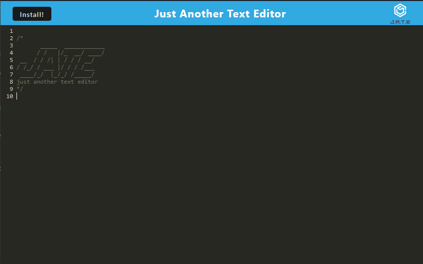
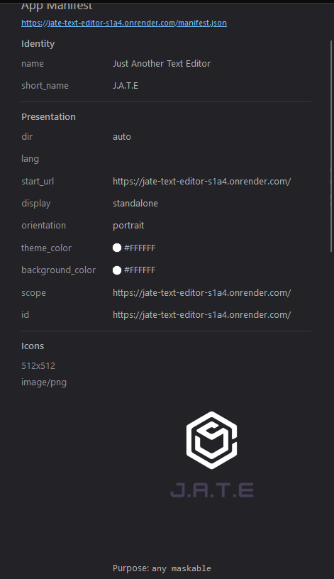
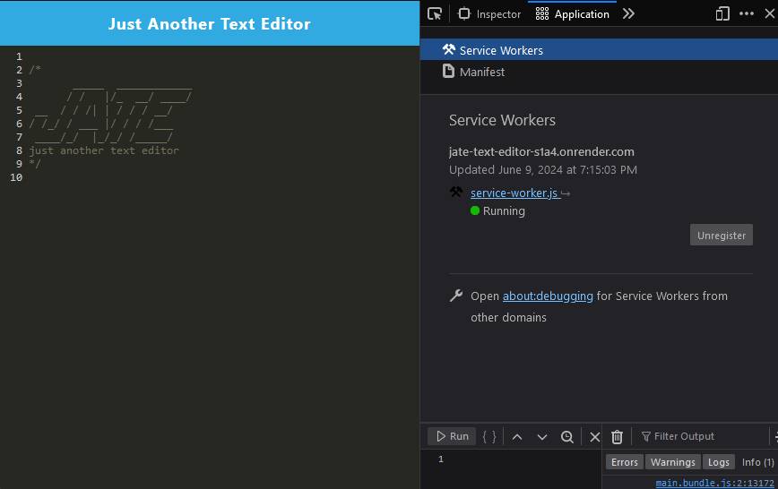

# Challenge 19: J.A.T.E

## Description
J.A.T.E (otherwise known as Just Another Text Editor) is a lightweight text editor with offline functionality that utilizes multiple data persistence techniques in case one is not supported by the browser.

## Table of Contents
- [Challenge 19: J.A.T.E](#challenge-19-jate)
  - [Description](#description)
  - [Table of Contents](#table-of-contents)
  - [Usage](#usage)
  - [Screenshots](#screenshots)
  - [Links](#links)
  - [License](#license)

## Usage
As this app is deployed through Render, local deployment is not required. The live application can be found [here](https://jate-text-editor-s1a4.onrender.com/).

## Screenshots

## Links
- [Deployed Application](https://jate-text-editor-s1a4.onrender.com/)
- [Repository Link](https://github.com/Nihsad/pwa-text-editor)

## License

This project is licensed under the MIT License. See the LICENSE file for details. 